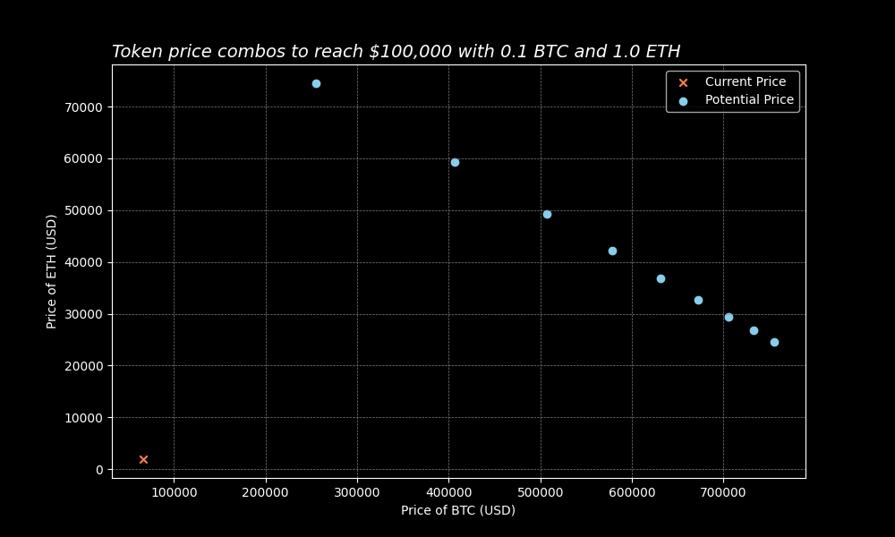

# Token Price Combinations
Generate and plot price combinations for two cryptocurrency tokens to reach a target portfolio value
with specific token quantities.

Built with Python, CoinMarketCap API, and linear algebra.

## Setup
### CoinMarketCap
1. Create a [CoinMarketCap](https://pro.coinmarketcap.com/) account
1. Login and retrieve API key

### Environment File
> Note: use .env.example as a template.
1. Create an .env file in the root directory
1. Open the .env file and type the following, using your CoinMarketCap API key: 
`COINMARKETCAP_KEY="type your key here"`
1. Save the file

## Usage
Run the main.py script from root directory: `python3 src/main.py`